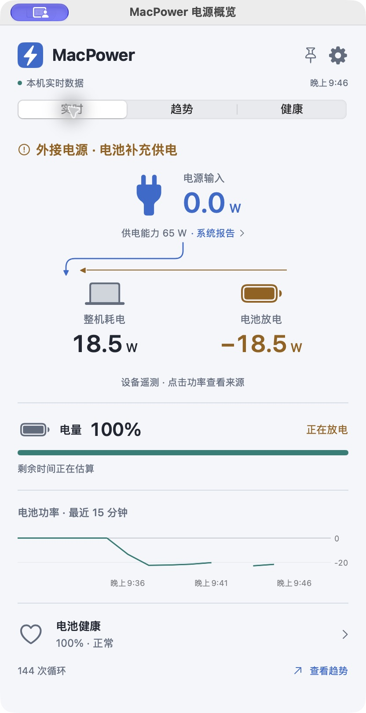
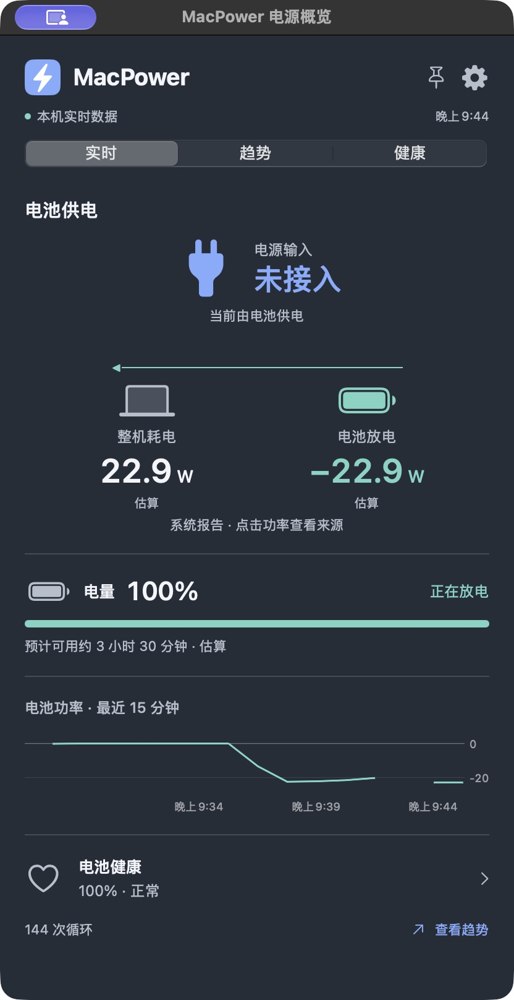

# MacPower

一款让 Mac 用户看懂供电、电池充放电与整机耗电的菜单栏工具。

当前版本：**MacPower 0.1.2 预览版**，按选定的方案 1 · Power Path 实现原生菜单栏程序，读取真实设备数据。支持电源输入、电池充放电、整机耗电、健康度与循环次数，包含历史曲线、CSV 导出、版本更新检查，以及深色、浅色、跟随系统三种外观。

## 使用原生应用

从 [Release v0.1.2](https://github.com/Linjay/MacPower/releases/tag/v0.1.2) 下载 `MacPower-0.1.2-arm64.zip`，解压后将 `MacPower.app` 放入“应用程序”并双击打开。升级前先退出旧版。此构建适用于 Apple Silicon Mac；源码最低部署目标为 macOS 14，实际验证环境是 macOS 27.0。

菜单栏默认显示整机耗电，即 Mac 当前运行的总功率；在设置中仍可切换电池净功率、电源输入或电量，已有手动选择会保留。点击数字打开面板，齿轮进入设置；右键菜单可打开独立概览窗口或退出。程序运行时再次打开应用也可显示概览窗口。

关闭窗口仍继续采集；设置自动保存。首次使用默认“跟随系统”，通知与登录启动默认关闭。数据只保存在 `~/Library/Application Support/MacPower/`，不会上传。

在“设置 → 软件更新”、应用菜单或菜单栏右键菜单选择“检查更新”。发现新版本后可查看说明，并通过浏览器下载对应架构的 ZIP；退出旧版后替换应用，本地历史和设置保留。可选择每天自动检查（默认关闭）和包含预览版（默认开启，现有发布均为预览版）。检查仅向 GitHub 请求公开版本信息，不发送设备数据；网络错误或 GitHub 限流时可直接打开官方发布页。更新检查从 v0.1.2 起提供，旧版用户需先从发布页下载升级。

这是 SwiftUI / AppKit 原生应用，不依赖浏览器。其他机器和旧版系统尚未实机验证。预览包使用临时签名，未做 Developer ID 签名和 Apple 公证，下载后可能被 Gatekeeper 拦截；不能将此包视作已完成正式分发验收。也可从源码在自己的 Mac 上构建。

## 从源码构建

```sh
zsh scripts/test.sh
zsh scripts/build-app.sh
```

需要 Apple Command Line Tools 或 Xcode，且工具链支持 Swift 6 / Swift Testing。输出在 `build/MacPower.app`。测试覆盖单位、方向、缺失值、健康、主题、历史积分和提醒规则；实机数据、界面与后台测试见 [原生验收记录](docs/native-acceptance.md)，实现与边界见 [原生实现说明](docs/native-implementation.md)。

运行 `zsh scripts/package-release.sh` 可在 `build/releases/` 生成独立应用包、ZIP 和 SHA-256 校验文件，不覆盖已经运行的本机应用。此脚本不自动发布到 GitHub。

## 界面预览

| 浅色 · 插电放电 | 深色 · 电池供电 |
|---|---|
|  |  |

两张截图来自不同的真实供电状态，功率与电量不是固定示例值。

## 当前边界

- 当前源码 46 项自动测试通过（含 17 项版本更新测试）；此前有效实机字段对照 32 项通过，3 项因采样间数据变化不作判定。新增测试不代表扩展了硬件验收范围。
- 10 分钟后台平均 CPU 0.36%；最终界面收尾版本的短时回归平均 CPU 0.30%。RSS 约 154 MiB，仍高于原定 80 MB 目标；physical footprint 快照约 61 MiB，二者口径分别保留。
- 睡眠唤醒、其他机型/旧版系统、通知/登录启动授权、完整无障碍和长期历史规模仍需进一步实机验收。
- 只监测，不控制充电。不可用的指标保留为空，估算结果带标记。

## 体验原型

早期网页设计原型保留在 `prototype/`，启动后默认预览地址为 `http://127.0.0.1:4173/`。这个网页仍使用示例数据，不是原生应用的数据入口。点击面板右上角齿轮 → 外观与显示，可切换三种外观。

实时、趋势、健康、设置和指标说明均可操作；演示控制区可切换充电、放电、暂停、满电、插电仍放电、缺失及过期数据。模拟系统外观只作用于网页演示，不修改 macOS 设置。

源码位于 `prototype/`。开发时在该目录运行 `npm install`、`npm run dev -- --host 127.0.0.1 --port 4173`；生产构建使用 `npm run build`。

## 设计文档

- [产品方案](docs/product-design.md)：定位、功能范围、指标定义、状态规则、交付阶段与验收标准。
- [交互与视觉规格](docs/interaction-visual-spec.md)：菜单栏、实时面板、趋势、健康、设置、异常状态与设计规范。
- [GitHub 调研与本机验证](docs/research.md)：参考项目、源码发现、Apple 文档和数据边界。
- [视觉探索记录](docs/visual-directions.md)：三种独立视觉方向、图片文件与生成提示词。
- [外观设置规格](docs/appearance.md)：主题优先级、保存、同步与浅深色语义颜色。
- [设计验收记录](design-qa.md)：视觉对照、交互验证及尚未覆盖的原生能力。

## 核心决定

1. 菜单栏默认显示**整机耗电**，例如 `34.0 W` 表示 Mac 当前运行的总功率，充入电池的功率另列。用户可以主动改为电池净功率、电源输入或电量；选定指标不会随供电状态自动切换，不可用时显示 `— W`。
2. 点开后同时解释**系统报告的供电能力、当前输入、电池充放电、整机耗电**。65 W 的供电能力不等于当前输入 65 W。
3. 首版只读监测，采用原生 macOS 交互，优先验证 Apple Silicon MacBook。保留验收的机型、测量口径与未覆盖范围，不把本机结果扩展到所有 Mac。
4. 不可用的数据显示 `—`；估算显示“估算”；过期数据显示最后更新时间。不能用充电器标称功率补出实际功率。

设计基准日期：2026-09-23，Asia/Hong_Kong。
